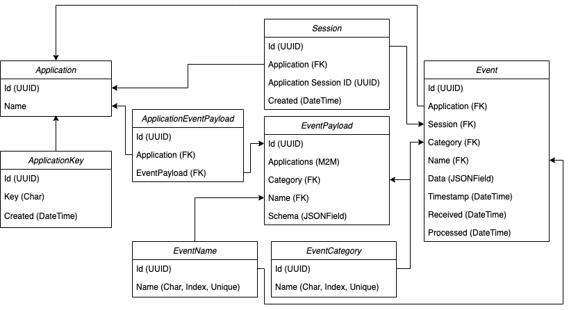

# Documentation

# ERD

# Entities
- Some assumptions were made:
    - For events within Sessions: the timestamp of an event is not being validated against existing events to account
  for the possible cases where the applications send events out of order;
    - Sessions have unique `session_id`s for specific `Application`s, meaning the `session_id` of an event could
  event repeat. To account for that, there's uniqueness enforced for both `Application` + a `application_session_id`
      (which is what the application sends as `session_id` initially);
    - `EventCategory` + `EventName` can have multiple payload definitions (`EventPayload`), but the applications
  can only conform to one specific `EventPayload` for a pair of `EventCategory` + `EventName`;
    - Multiple applications can share `EventPayload`s;